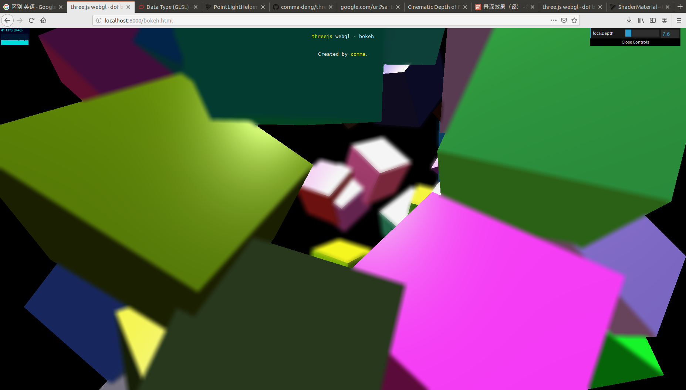
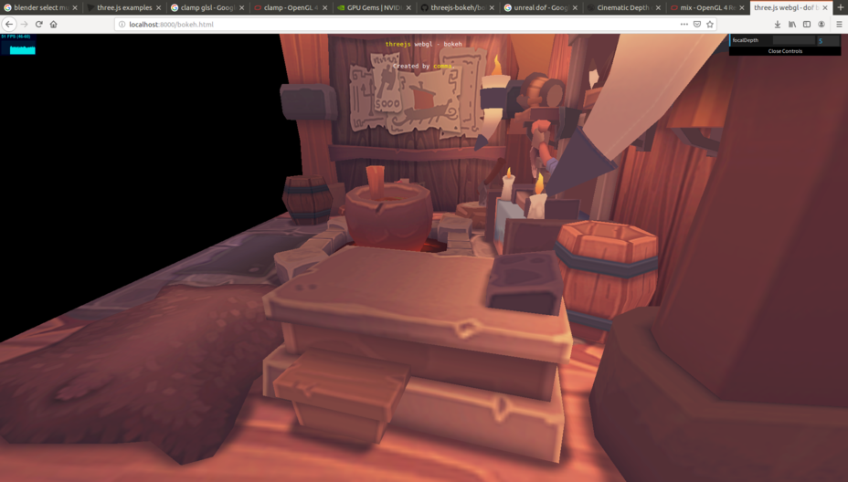

### threejs - bokeh
a simple bokeh effect implemented using three.js.

with bokeh shader

without bokeh shader

model: [Viking room](https://sketchfab.com/3d-models/viking-room-a49f1b8e4f5c4ecf9e1fe7d81915ad38)

