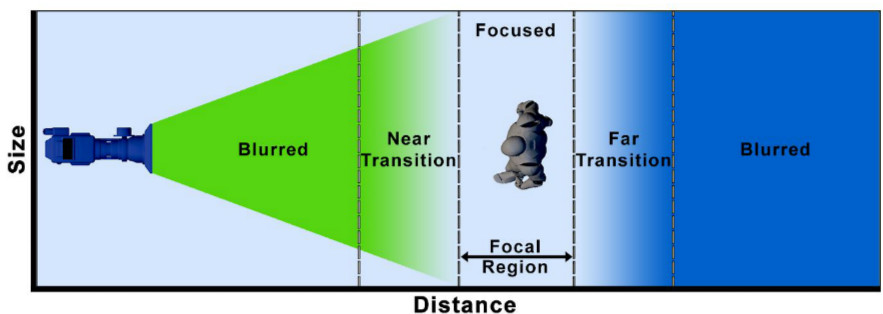
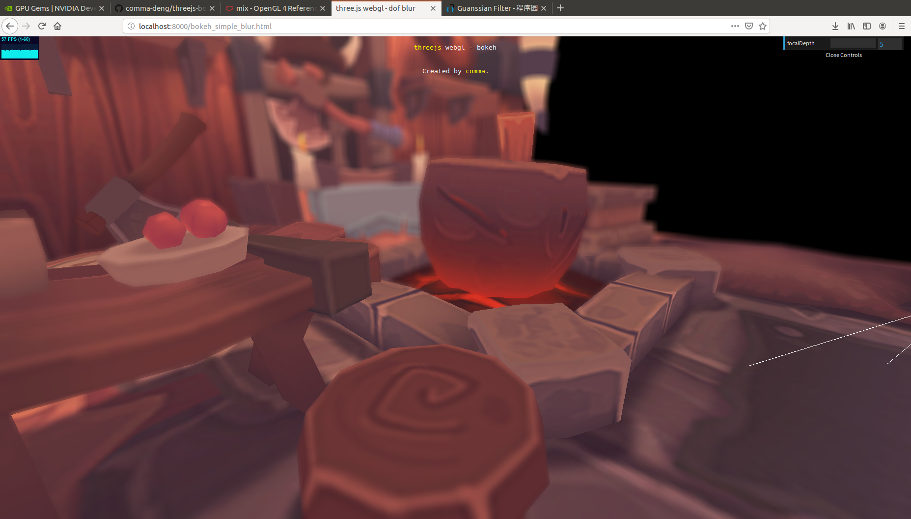
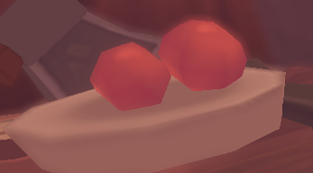
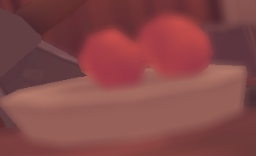
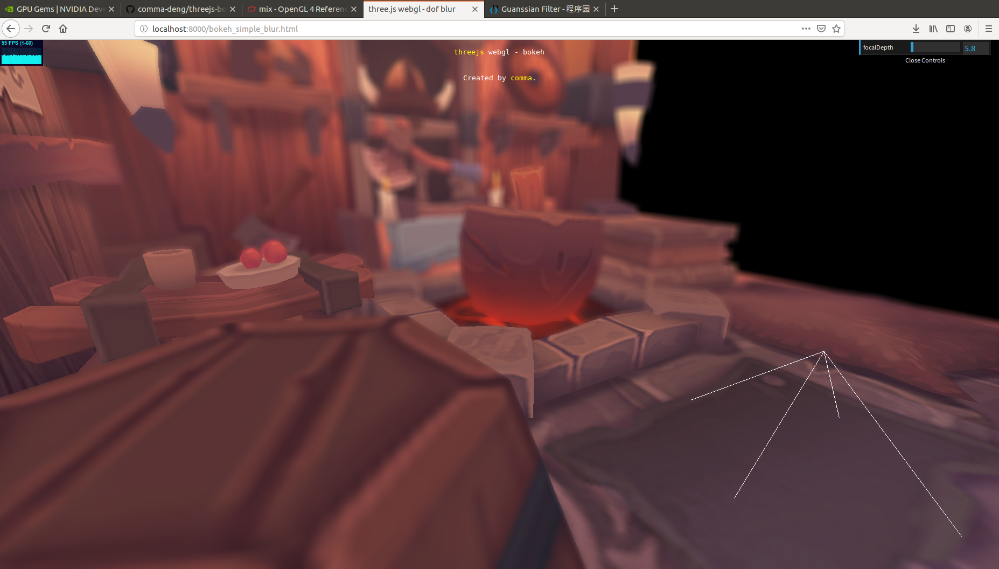

## webgl - 实现景深效果（一）

### 前言
最近对摄影颇有兴趣，入了一个定焦头，能拍出有景深效果的片了。因为对景深效果有点着迷，就想着在渲染中能不能实现类似的效果。玩了八方旅人之后发觉是这是可行的，于是google之，找了一些资料，自己撸了一个简单的景深效果。

### 现实中相机产生景深效果原理
相机在成像的时候，存在一个合焦面，只有处于合焦面上的物体成像是最清晰的，而合焦面之外的平面所成的像，是模糊的。

现实世界中的一点在照片上成的像，并不是理想的一个点，而是一个光斑。处在合焦面上的点，在相机上所成的像，可认为是一个理想的点。而不在合焦面上的点，所成的像是一个光斑。光斑的大小称为circle of confusion（coc） 。

离合焦面越远，光斑越大，所以将相机对着近处物体对焦，越远的物体越模糊；光圈越大，光斑也越大，所以用大光圈更容易拍出景深效果。

### 实现思路

引用一张来自unreal官方文档的图。[1]

将相机坐标系空间分为五个部分。两个Blurred区域是全糊的，NEAR Transition和Far Transition区域是由清晰到糊过渡的，Focused区域是清晰的。具体的实现思路就是，创建一张模糊图像（可用box blur， guassian blur），与原始图像混合。在Blurred区域，模糊图像的比重为1，原始图像的比重为0。在Focused区域，模糊图像比重为0，原始图像比重为1。两个Transition区域就线性混合。

### 实现
首先，实现景深效果属于后期处理，一遍渲染是不行的，我们得渲染两遍。第一遍渲染是渲染场景rgb和深度到缓冲中（在计算景深时需要用到深度信息），第二遍渲染做后期处理。

这里创建了一个WebGLRenderTarget，第一遍渲染就是渲染到WebGLRenderTarget上：

```
    target = new THREE.WebGLRenderTarget( window.innerWidth, window.innerHeight );
    target.texture.format = THREE.RGBFormat;
    target.texture.minFilter = THREE.NearestFilter;
    target.texture.magFilter = THREE.NearestFilter;
    target.texture.generateMipmaps = false;
    target.stencilBuffer = false;
    target.depthBuffer = true;
    target.depthTexture = new THREE.DepthTexture();
    target.depthTexture.type = THREE.UnsignedShortType;
```

两遍渲染。
```
    renderer.setRenderTarget( target );
    renderer.render( scene, camera );

    // render post FX
    renderer.setRenderTarget( null );
    renderer.render( postScene, postCamera );
```

vertex shader很简单，只需要计算gl_Position并且输出uv坐标。
```
    varying vec2 vUv;

    void main() {
        vUv = uv;
        gl_Position = projectionMatrix * modelViewMatrix * vec4(position, 1.0);
    }
```

fragment shader就是上一节提到的流程，根据 depth 计算 coc， 对原始图像和模糊图像进行混合。我这里的 coc 并不是按物理定律算光斑大小，只是简单算了一个混合比例。
```
    varying vec2 vUv;
    uniform sampler2D tColor;
    uniform sampler2D tDepth;
    uniform float cameraNear;
    uniform float cameraFar;
    uniform float focalDepth; 
    uniform float farStart;  
    uniform float farRange;
    uniform float nearStart;
    uniform float nearRange;
    uniform float textureWidth;
    uniform float textureHeight;

    const int circleSize = 8;

    void main() {
        vec3 color = texture2D( tColor, vUv ).rgb;
        float depth = readDepth( tDepth, vUv );

        float depthVal =  -depth - focalDepth;
        float coc = 0.0;

        if(depthVal < 0.0)
        {
            coc = (-depthVal - nearStart) / nearRange;
        }
        else
        {
            coc = (depthVal - farStart) / farRange;
        }

        coc = clamp(coc, 0.0, 1.0);

        vec3 colorBlur = getColorBlur(vUv);                
        vec3 colorMix = mix(color, colorBlur, coc);

        gl_FragColor.rgb = vec3(colorMix);
        gl_FragColor.a = 1.0;
    }
```
getColorBlur() 是计算模糊后像素点的颜色。可以采用高斯模糊。我这里偷懒，没有写高斯模糊，只是简单的在圆内进行采样，根据到圆心的距离决定像素的权重。
```
    vec3 getColorBlur(vec2 uv){
        vec2 curUv;
        vec3 color = vec3(0.0, 0.0, 0.0);
        vec2 textureRatio = vec2(1.0/textureWidth, 1.0/textureHeight);
        float weightTotal = 0.0;
        float circleSizef = float(circleSize);
        for(int i=-circleSize; i<circleSize; i++)
            for(int j=-circleSize; j<circleSize; j++)
            {
                vec2 dir =  vec2(i, j) * textureRatio;
                float dist = length(dir);

                // only sample in a circle.
                if(dist > float(circleSize))
                    continue;
                curUv = uv + dir;
                float depth = readDepth(tDepth, curUv);
                
                float weight = getWeight(dist, circleSizef);
                color += weight * texture2D( tColor, curUv ).rgb;
                weightTotal += getWeight(dist, circleSizef);
            }
        return color * (1.0 / weightTotal);
    }
```
### 结果与分析

一个最简单的景深效果就完成了，来看下效果：


好像。。还行？诶等等，这里看起来不太对：



盘子里的右边的红色小球出现了诡异的自发光效果。。。难道这个球失焦了？不对，右边的小球和盘子的边界明明很清晰，如果失焦应该连着盘子一起糊掉，像这样：




我们来分析一下出了什么问题，对于小球来说，它是对焦的，其coc=0。而后景是失焦的，其coc!=0。这样，后景就会融入小球的颜色。


再仔细看看，前景模糊好像也不尽人意，左下角的酒桶虽然内部糊掉了，但它的边缘还是很清晰，看起来很生硬：



这是因为对焦区域的coc=0，不会混入前景的颜色。

总结一下，现在我们面临两个问题
- 后景混入了对焦区域的颜色
- 前景边缘过于清晰 


如何解决这两个问题呢？这个问题嘛，且听下回分解。

### code
本文的代码放在github上，这一部分的代码写在一个文件 bokeh_simple_blur.html 中。

传送门：
https://github.com/comma-deng/threejs-bokeh

### 参考文献

【1】Mobile Depth of Field Method. https://docs.unrealengine.com/en-US/Engine/Rendering/PostProcessEffects/DepthOfField/MobileDOFMethods/index.html