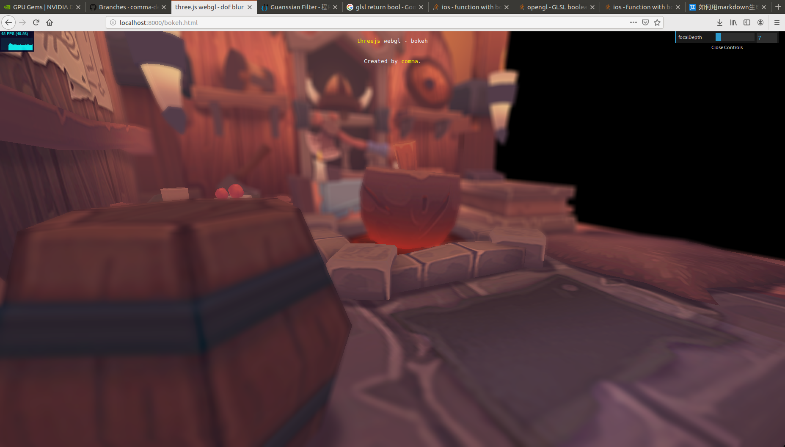
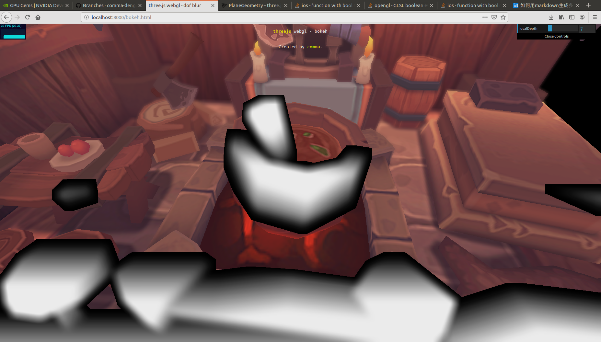
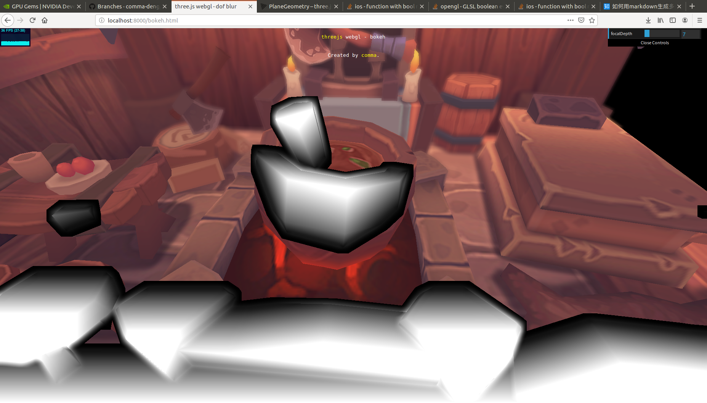
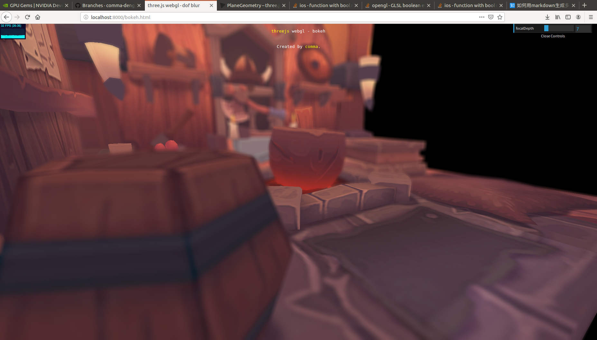

## webgl - 实现景深效果（二）

上回我们说到，仅仅使用简单的混合会导致渲染出现两个问题：
- 后景混入了对焦区域的颜色
- 前景边缘过于清晰 


那么如何解决这两个问题呢？答案是对前景和后景分开做处理。我们可以先处理后景，再处理前景。

### 后景处理
后景混入前景的问题好办，在计算模糊时，我们对范围内每一个像素做一个判断，如果是前景或者对焦区域的点，就将其排除掉。

### 前景处理
前景边缘过于清晰的问题就需要用点小技巧了：首先，我们计算每一个像素的coc。如果是对焦范围内的点或后景，其coc置为零。这样可以得到一张coc图像，对该图像做模糊，用模糊后的coc图像做混合，这样就可以让前景的边界不那么清晰。但光是这样还是会有一点问题，因为模糊之后，前景边缘本来是1的部分会变得小于1，这样看起来边缘还是有点生硬：

注意看酒桶边缘，看起来还是不太理想。所以我们要对模糊后的coc图像做一个逐像素的处理：
D = max(D0,2Db-D0) 

这个公式是怎么来的呢？假设我们的coc图像有两个区域，两个区域有明显的分界线。在分界线一侧的coc值为D0, 另一侧为D1。那么我们可以近似认为，对模糊后的coc值，有：

Db = 1/2 * (D0 + D1)

那么，

D1 = 2DB - D0

我们希望在边缘部分，取得较大的那个coc值，则有：

D = max(D0, D1) = max(D0,2Db-D0)

为了展示 max(D0,2Db-D0)的效果，这里我把前景部分的rgb设为了coc值。对比一下处理前后:


仅模糊


模糊 +  max(D0,2Db-D0)处理

可以看到处理之后边缘得到了明显的增强、并且边缘部分变亮了。

再来看看这样处理之后酒桶的边缘：

嗯，终于边缘糊掉了，是想要的效果233

对了，这个思路来自GPU Gems【1】

### 实现思路
上一篇文章中，我们使用两遍渲染得到了最终结果。这次我们需要三遍渲染才能得到最终结果。

- 第一遍渲染，渲染rgba和深度；

- 第二遍渲染，计算coc，根据coc的正负，可以判断是前景还是后景，还是对焦部分。
    - 如果是后景，计算模糊后的rgb，并根据coc进行混合。注意，在计算模糊后的颜色时，要排除掉其中是前景的部分。然后将a通道设为0。
    - 如果是前景或者对焦部分，rgb不作处理，将a通道设为coc的值。

- 第三遍渲染，对上一步得到的图像的a通道（存储了coc的值）进行模糊。模糊后对每个像素应用 D = max(D0,2Db-D0) 。最后根据a通道的值，对图像的rgb通道进行模糊处理。


### 实现
第二遍渲染的fragment shader,这里只处理后景:

```
void main() {
    vec3 color = texture2D( tColor, vUv ).rgb;
    float depth = readDepth( tDepth, vUv );

    float depthVal =  -depth - focalDepth;
    float coc = 0.0;

    if(depthVal < 0.0)
    {
        coc = (-depthVal - nearStart) / nearRange;
    }
    else
    {
        coc = (depthVal - farStart) / farRange;
    }

    coc = clamp(coc, 0.0, 1.0);
    bool isForeGroundOrFocus = -depth - (focalDepth + farStart) < 0.0; 

    // this shader only handle background.
    //  "a" channel stores the coc value.
    if(isForeGroundOrFocus) 
    {
        gl_FragColor.rgb = color;
        gl_FragColor.a = coc;
    }
    else
    {
        vec3 colorBlur = getColorBlur(vUv);                
        vec3 colorMix = mix(color, colorBlur, coc);
        gl_FragColor.rgb = vec3(colorMix);
    }
					
```

第三遍渲染的fragment shader，这里处理前景。
```
void main() {
    vec3 blurColor = vec3(0.0);
    float coc = 0.0;
    const int cocBlurSize = 8;
    float cocBlurSizef = float(cocBlurSize);
    const int bokehBlurSize = 8;
    float bokehBlurSizef = float(bokehBlurSize);
    vec2 textureRatio = vec2(1.0/textureWidth, 1.0/textureHeight);
    vec3 sourceColor = texture2D(tColor, vUv).rgb;

    // blur the coc
    float cocBlurWeightTotal = 0.0;
    for(int i=-cocBlurSize; i<cocBlurSize; i++)
            for(int j=-cocBlurSize; j<cocBlurSize; j++)
            {
                vec2 dir =  vec2(i, j) * textureRatio;
                float dist = length(dir);
                if(dist > cocBlurSizef)
                    continue;
                float weight = 1.0; // getWeight(dist, cocBlurSizef);
                cocBlurWeightTotal += weight;
                vec2 curUv = dir + vUv;
                coc += weight * texture2D(tColor, curUv).a;
            }
    coc /= cocBlurWeightTotal;
    float originalCoc = texture2D(tColor, vUv).a;

    // according to https://developer.nvidia.com/gpugems/GPUGems3/gpugems3_ch28.html
    coc = 2.0 * max(originalCoc, coc) - originalCoc;
    
    
    float bokehBlurWeightTotal = 0.0;
    if (coc > 1e-5)
    {
        for(int i=-bokehBlurSize; i<bokehBlurSize; i++)
            for(int j=-bokehBlurSize; j<bokehBlurSize; j++)
            {
                vec2 dir = vec2(i, j) * textureRatio;  // can optimize
                float dist = length(dir);
                if(dist > bokehBlurSizef)
                    continue;
                vec2 curUv = dir + vUv;
                float weight = getWeight(dist, bokehBlurSizef); 
                bokehBlurWeightTotal += weight;
                blurColor +=  weight * texture2D(tColor, curUv).rgb;
            }
        blurColor /= bokehBlurWeightTotal;
        
        gl_FragColor.rgb = mix(sourceColor, blurColor, coc);
    }
    else
    {
        gl_FragColor.rgb = sourceColor;
    }
    gl_FragColor.a = 1.0;
}
```

### code
本文的代码放在github上，这一部分的代码写在一个文件 bokeh.html 中。

传送门：
https://github.com/comma-deng/threejs-bokeh


### 参考文献
【1】GPU Gems. Chapter 28. Practical Post-Process Depth of Field. https://developer.nvidia.com/gpugems/GPUGems3/gpugems3_ch28.html

