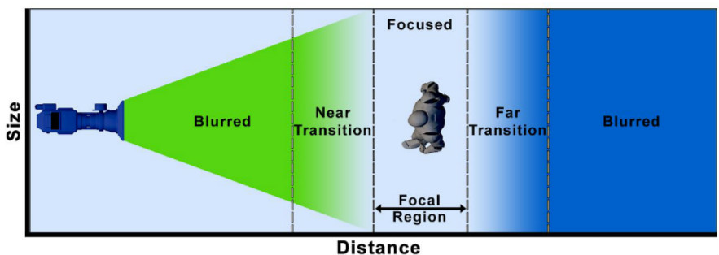

## 用Threejs实现景深效果

### 前言
最近对拍照颇有兴趣，入了一个定焦头，能拍出有景深效果的片了。因为对景深效果有点着迷，就想着在渲染中能不能实现类似的效果。玩了八方旅人之后发觉是这是可行的，于是google之，找了一些资料，自己撸了一个简单的景深效果。

### 现实中相机产生景深效果原理
相机在成像的时候，存在一个合焦面，只有处于合焦面上的物体成像是最清晰的，而合焦面之外的平面所成的像，是模糊的。

现实世界中的一点在照片上成的像，并不是理想的一个点，而是一个光斑。处在合焦面上的点，在相机上所成的像，可认为是一个理想的点。而不在合焦面上的点，所成的像是一个光斑。

离合焦面越远，光斑越大，所以将相机对着近处物体对焦，越远的物体越模糊；光圈越大，光斑也越大，所以用大光圈更容易拍出景深效果。

### 景深效果模型

引用一张来自unreal官方文档的图。（https://docs.unrealengine.com/en-US/Engine/Rendering/PostProcessEffects/DepthOfField/MobileDOFMethods/index.html ）

相机坐标系空间可以分为五个部分。两个Blurred区域是全糊的，NEAR Transition和Far Transition区域是由清晰到糊过渡的，Focused区域是清晰的。具体的实现思路就是，创建一张模糊图像（可用box blur， guassian blur），与原始图像混合。在Blurred区域，模糊图像的比重为1，原始图像的比重为0。在Focused区域，模糊图像比重为0，原始图像比重为1。两个Transition区域就线性混合。

### 实现
首先，实现景深效果属于后期处理，所以一遍渲染是不行的。我们得创建一个新的渲染目标RenderTarget。第一遍渲染是渲染到这个渲染目标，第二遍渲染才渲染到屏幕。

由于在计算景深时需要用到深度信息，我们需要创建一张纹理，附加到深度缓冲上。

```
    target = new THREE.WebGLRenderTarget( window.innerWidth, window.innerHeight );
    target.texture.format = THREE.RGBFormat;
    target.texture.minFilter = THREE.NearestFilter;
    target.texture.magFilter = THREE.NearestFilter;
    target.texture.generateMipmaps = false;
    target.stencilBuffer = false;
    target.depthBuffer = true;
    target.depthTexture = new THREE.DepthTexture();
    target.depthTexture.type = THREE.UnsignedShortType;
```

两遍渲染。
```
    renderer.setRenderTarget( target );
    renderer.render( scene, camera );

    // render post FX
    renderer.setRenderTarget( null );
    renderer.render( postScene, postCamera );
```

vertex shader很简单，只需要计算gl_Position并且输出uv坐标。
```
    varying vec2 vUv;

    void main() {
        vUv = uv;
        gl_Position = projectionMatrix * modelViewMatrix * vec4(position, 1.0);
    }
```


fragment shader就是上一节提到的流程，对原始图像和模糊图像进行混合。
```
    vec3 color = texture2D( tColor, vUv ).rgb;
    float depth = readDepth( tDepth, vUv );

    float depthVal =  -depth - focalDepth;
    float blurRatio = 0.0;

    if(depthVal < 0.0)
    {
        blurRatio = (-depthVal - nearStart) / nearRange;
    }
    else
    {
        blurRatio = (depthVal - farStart) / farRange;
    }

    blurRatio = clamp(blurRatio, 0.0, 1.0);
    bool isForeGround = depthVal < 0.0; 

    // foreground and backGound need separate blur
    vec3 colorBlur = getColorBlur(vUv, isForeGround);                
    vec3 colorMix = mix(color, colorBlur, blurRatio);

    gl_FragColor.rgb = vec3(colorMix);
    gl_FragColor.a = 1.0;
```
